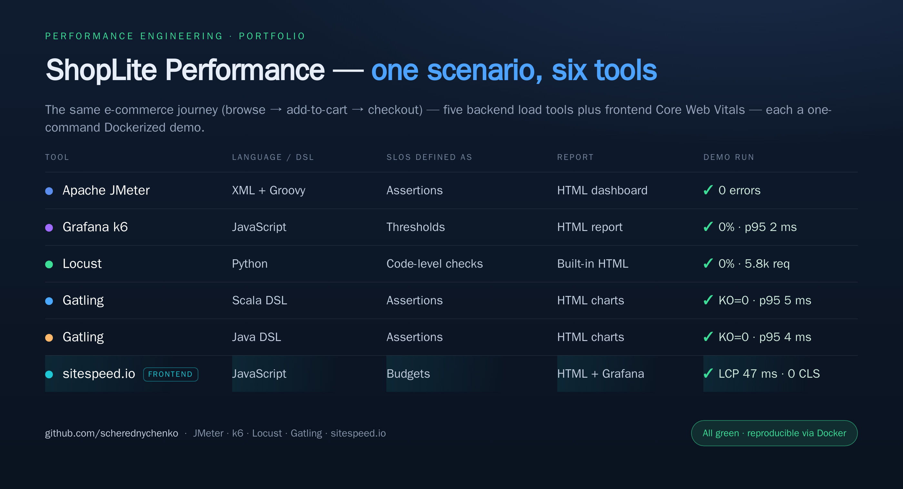
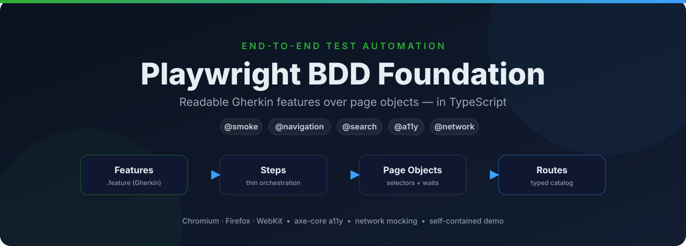

### Hi, I'm Sergiy 👋

**Performance Engineering & AI Quality Testing for product teams** — load & stress audits, LLM evaluations, EU AI Act readiness.

📍 Croatia &nbsp;·&nbsp; 🔗 [LinkedIn](https://www.linkedin.com/in/sergiycherednychenko/) &nbsp;·&nbsp; 🌐 [professional-qa-services.com](https://www.professional-qa-services.com/english/)

---

## 🚀 Featured — ShopLite Load Tests: one scenario, six tools

The same e-commerce journey (**browse → add-to-cart → checkout**), implemented across five load-testing tools (plus a frontend Core Web Vitals one) — each a **one-command Dockerized demo** that spins up a mock backend,
runs the test, and produces an HTML report.

| Tool | Language / DSL | SLOs as | Report | Repo |
|---|---|---|---|---|
| Apache JMeter | XML + Groovy | Assertions | HTML dashboard | [ShopLite-load-tests](https://github.com/scherednychenko/ShopLite-load-tests) |
| Grafana k6 | JavaScript | Thresholds | HTML report | [ShopLite-load-tests-k6](https://github.com/scherednychenko/ShopLite-load-tests-k6) |
| Locust | Python | Code-level checks | Built-in HTML | [ShopLite-load-tests-locust](https://github.com/scherednychenko/ShopLite-load-tests-locust) |
| Gatling | Scala DSL | Assertions | HTML charts | [ShopLite-load-tests-gatling-scala](https://github.com/scherednychenko/ShopLite-load-tests-gatling-scala) |
| Gatling | Java DSL | Assertions | HTML charts | [ShopLite-load-tests-gatling-javaDSL](https://github.com/scherednychenko/ShopLite-load-tests-gatling-javaDSL) |
| sitespeed.io | JavaScript | Budgets | HTML + Grafana | [ShopLite-ui-perf](https://github.com/scherednychenko/ShopLite-ui-perf) |
| **Observability** | InfluxDB + Grafana | — | Live dashboards | [ShopLite-observability](https://github.com/scherednychenko/ShopLite-observability) |

Each repo also ships a documented test strategy — SLIs/SLOs, test cadence, environment
constraints, and how performance testing fits into an Agile team's rituals.

> 💡 **The script is the easy part.** The real value is knowing *what* to test, shaping the load model, reading the results, and turning them into a go/no-go call — judgment a demo can't capture.

---

## 🎭 Featured — Playwright BDD Foundation: readable E2E automation

A small, readable **BDD + Playwright** end-to-end starter in TypeScript. Gherkin features
sit on top of page objects backed by a typed route catalog, so the suite **reads like product
behavior** while selectors and waits stay localized. It ships a bundled demo app, so the tests
are **green the moment you clone it** — no external environment, no flaky shared staging.

- **Layered design** — features → steps → page objects → typed route catalog
- **Network interception** for deterministic failure-path tests · **axe-core** accessibility gating (WCAG 2.1 A/AA)
- **Tag-based CI slicing**, cross-browser (Chromium/Firefox/WebKit), traces · screenshots · video on failure
- **CI-ready** — GitHub Actions runs typecheck, lint, format & the suite on every PR; Dependabot keeps deps current

→ [**playwright-bdd-foundation**](https://github.com/scherednychenko/playwright-bdd-foundation)

---

### 🧰 What I work on
- **Performance & load testing** — JMeter · k6 · Locust · Gatling · sitespeed.io · Grafana + InfluxDB dashboards
- **AI quality testing** — LLM evaluations, red teaming, EU AI Act readiness
- **Test automation** — standing up maintainable E2E frameworks (Playwright + BDD, TypeScript): page-object architecture, network mocking, accessibility checks, CI-gated suites
- **Test strategy** — SLIs/SLOs, CI integration, reporting that non-engineers can read
